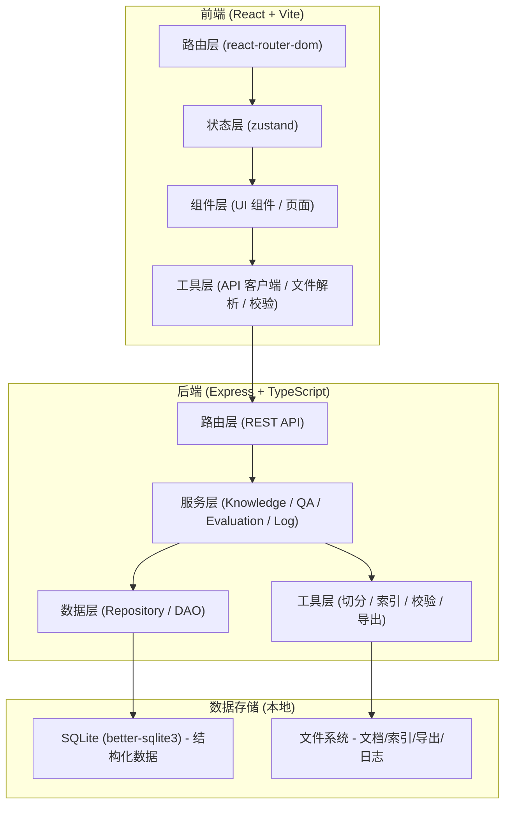
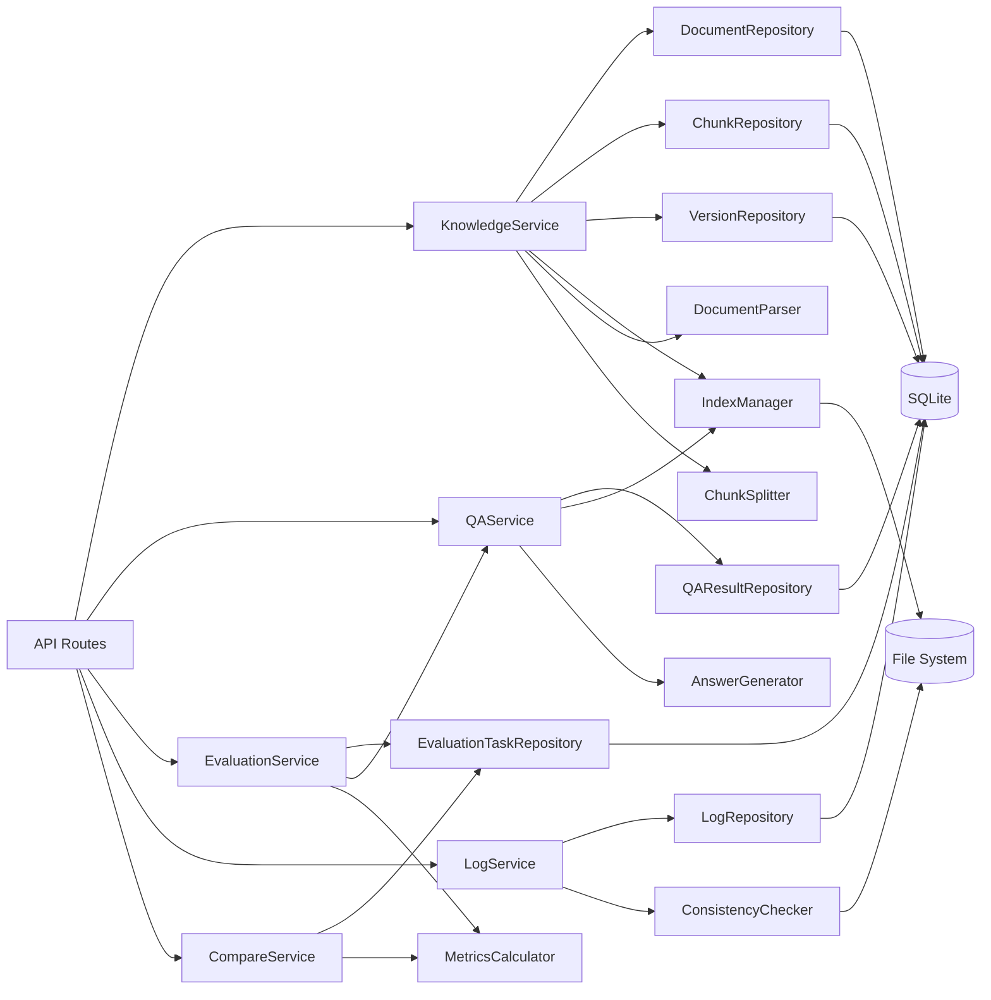
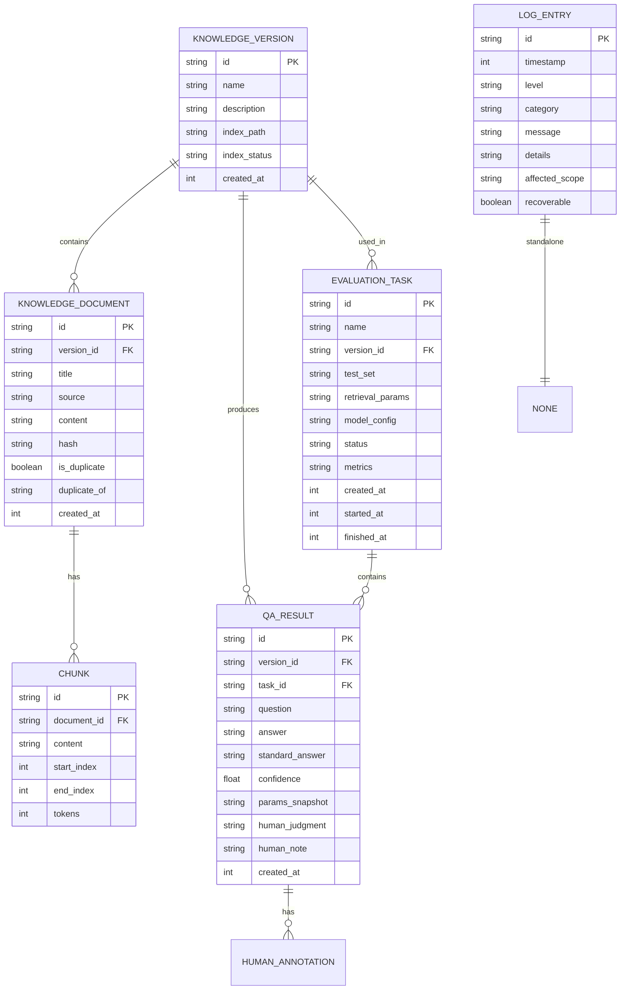

## 1. 架构设计



## 2. 技术说明

- 前端：React@18 + TypeScript + tailwindcss@3 + vite + react-router-dom + zustand + lucide-react + recharts
- 后端：Express@4 + TypeScript + better-sqlite3 + multer
- 切分与索引：本地 TF-IDF + 倒排索引（纯 Node 实现，无需外部服务）
- 数据存储：SQLite（结构化元数据、评测、日志） + 文件系统（原始文档、切分结果、索引文件、导出报告）
- 初始化工具：vite-init（react-express-ts 模板）

## 3. 路由定义

| 前端路由 | 页面 | 说明 |
|---------|------|------|
| / | 知识库管理 | 导入文档、查看列表、索引状态、版本管理 |
| /qa | 问答测试台 | 单问测试、人工修订、保存判定 |
| /evaluation | 批量评测 | 评测任务、结果查看、导出报告 |
| /compare | 版本对比 | 多版本/参数对比、差异分析 |
| /logs | 系统日志 | 操作/错误日志、一致性校验 |

| 后端 API 路由 | 方法 | 说明 |
|-------------|------|------|
| /api/knowledge/import | POST | 导入知识源文件 |
| /api/knowledge/documents | GET | 获取文档列表 |
| /api/knowledge/documents/:id | DELETE | 删除文档 |
| /api/knowledge/versions | GET/POST | 知识库版本列表/创建 |
| /api/knowledge/index | GET/POST | 索引状态/重建 |
| /api/qa/ask | POST | 提问并返回检索+答案 |
| /api/qa/annotate | POST | 保存人工修订与判定 |
| /api/evaluation/tasks | GET/POST | 评测任务列表/创建 |
| /api/evaluation/tasks/:id/run | POST | 执行评测任务 |
| /api/evaluation/tasks/:id | GET | 获取评测结果 |
| /api/evaluation/tasks/:id/export | GET | 导出评测报告 |
| /api/compare | POST | 执行版本对比 |
| /api/compare/export | POST | 导出对比报告 |
| /api/logs | GET | 获取日志列表 |
| /api/logs/consistency | GET | 数据一致性校验 |

## 4. API 定义（类型）

```typescript
// 知识文档
interface KnowledgeDocument {
  id: string;
  title: string;
  source: 'markdown' | 'faq' | 'history';
  content: string;
  chunkCount: number;
  createdAt: number;
  version: string;
  hash: string;
  isDuplicate: boolean;
  duplicateOf?: string;
}

// 文档切分
interface Chunk {
  id: string;
  documentId: string;
  content: string;
  startIndex: number;
  endIndex: number;
  tokens: number;
}

// 知识库版本
interface KnowledgeVersion {
  id: string;
  name: string;
  description: string;
  documentIds: string[];
  createdAt: number;
  indexPath: string;
  indexStatus: 'building' | 'ready' | 'corrupted';
}

// 检索参数
interface RetrievalParams {
  topK: number;
  minScore: number;
  chunkSize: number;
  chunkOverlap: number;
  useBM25: boolean;
}

// 问答请求
interface QARequest {
  question: string;
  versionId: string;
  retrievalParams: RetrievalParams;
  modelConfig?: { name: string; temperature: number };
}

// 问答结果
interface QAResult {
  id: string;
  question: string;
  retrievedChunks: Array<{ chunkId: string; content: string; score: number; documentTitle: string }>;
  answer: string;
  standardAnswer?: string;
  confidence: number;
  createdAt: number;
  paramsSnapshot: RetrievalParams & { modelConfig?: any };
  humanJudgment?: 'correct' | 'partial' | 'wrong';
  humanNote?: string;
}

// 评测任务
interface EvaluationTask {
  id: string;
  name: string;
  testSet: Array<{ question: string; standardAnswer: string }>;
  versionId: string;
  retrievalParams: RetrievalParams;
  modelConfig?: any;
  status: 'pending' | 'running' | 'done' | 'failed';
  results?: QAResult[];
  metrics?: { accuracy: number; f1: number; avgConfidence: number };
  createdAt: number;
  startedAt?: number;
  finishedAt?: number;
}

// 日志条目
interface LogEntry {
  id: string;
  timestamp: number;
  level: 'info' | 'warn' | 'error';
  category: 'import' | 'index' | 'qa' | 'evaluation' | 'system';
  message: string;
  details?: any;
  affectedScope?: string;
  recoverable?: boolean;
}

// 一致性校验结果
interface ConsistencyReport {
  timestamp: number;
  issues: Array<{ type: string; description: string; affectedIds: string[]; fix?: string }>;
  summary: { totalChecks: number; passed: number; failed: number };
}
```

## 5. 服务端架构图



## 6. 数据模型

### 6.1 ER 图



### 6.2 DDL 语句

```sql
CREATE TABLE IF NOT EXISTS knowledge_version (
  id TEXT PRIMARY KEY,
  name TEXT NOT NULL,
  description TEXT,
  index_path TEXT,
  index_status TEXT NOT NULL DEFAULT 'building',
  created_at INTEGER NOT NULL
);

CREATE TABLE IF NOT EXISTS knowledge_document (
  id TEXT PRIMARY KEY,
  version_id TEXT NOT NULL,
  title TEXT NOT NULL,
  source TEXT NOT NULL,
  content TEXT,
  hash TEXT NOT NULL,
  is_duplicate INTEGER NOT NULL DEFAULT 0,
  duplicate_of TEXT,
  created_at INTEGER NOT NULL,
  FOREIGN KEY (version_id) REFERENCES knowledge_version(id)
);

CREATE INDEX IF NOT EXISTS idx_doc_version ON knowledge_document(version_id);
CREATE INDEX IF NOT EXISTS idx_doc_hash ON knowledge_document(hash);

CREATE TABLE IF NOT EXISTS chunk (
  id TEXT PRIMARY KEY,
  document_id TEXT NOT NULL,
  content TEXT NOT NULL,
  start_index INTEGER NOT NULL,
  end_index INTEGER NOT NULL,
  tokens INTEGER NOT NULL,
  FOREIGN KEY (document_id) REFERENCES knowledge_document(id)
);

CREATE INDEX IF NOT EXISTS idx_chunk_doc ON chunk(document_id);

CREATE TABLE IF NOT EXISTS qa_result (
  id TEXT PRIMARY KEY,
  version_id TEXT NOT NULL,
  task_id TEXT,
  question TEXT NOT NULL,
  answer TEXT,
  standard_answer TEXT,
  confidence REAL,
  params_snapshot TEXT,
  human_judgment TEXT,
  human_note TEXT,
  created_at INTEGER NOT NULL,
  FOREIGN KEY (version_id) REFERENCES knowledge_version(id)
);

CREATE INDEX IF NOT EXISTS idx_qa_version ON qa_result(version_id);
CREATE INDEX IF NOT EXISTS idx_qa_task ON qa_result(task_id);

CREATE TABLE IF NOT EXISTS evaluation_task (
  id TEXT PRIMARY KEY,
  name TEXT NOT NULL,
  version_id TEXT NOT NULL,
  test_set TEXT NOT NULL,
  retrieval_params TEXT NOT NULL,
  model_config TEXT,
  status TEXT NOT NULL DEFAULT 'pending',
  metrics TEXT,
  created_at INTEGER NOT NULL,
  started_at INTEGER,
  finished_at INTEGER,
  FOREIGN KEY (version_id) REFERENCES knowledge_version(id)
);

CREATE TABLE IF NOT EXISTS log_entry (
  id TEXT PRIMARY KEY,
  timestamp INTEGER NOT NULL,
  level TEXT NOT NULL,
  category TEXT NOT NULL,
  message TEXT NOT NULL,
  details TEXT,
  affected_scope TEXT,
  recoverable INTEGER
);

CREATE INDEX IF NOT EXISTS idx_log_time ON log_entry(timestamp);
CREATE INDEX IF NOT EXISTS idx_log_level ON log_entry(level);
```
