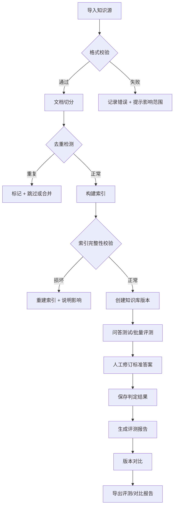

## 1. 产品概述

本地运行的客服知识库问答评测台，用于构建、测试和优化客服问答系统。支持导入多种格式知识源、切分索引、检索问答、人工修订、批量评测和版本对比，确保知识库质量和问答效果可量化。

- 主要用户：客服运营人员、AI 算法工程师、QA 测试人员
- 核心价值：提供可复现、可对比、可追溯的知识库评测流程

## 2. 核心功能

### 2.1 用户角色

| 角色 | 注册方式 | 核心权限 |
|------|---------|---------|
| 本地管理员 | 本地登录（默认） | 所有功能：建库、问答、评测、导出 |

### 2.2 功能模块

1. **知识库管理**：导入 Markdown/FAQ 表格/历史问答、文档切分、索引构建、版本管理
2. **检索问答台**：单问检索、答案生成、上下文展示、人工改写标准答案、保存判定
3. **批量评测**：导入评测集、批量运行问答、自动评分、人工复核、生成评测报告
4. **版本对比**：对比不同知识库版本或模型参数下的评测结果
5. **系统日志**：错误日志、操作记录、参数变更历史、数据一致性校验

### 2.3 页面详情

| 页面名称 | 模块名称 | 功能描述 |
|---------|---------|---------|
| 知识库管理 | 导入面板 | 支持拖拽上传 Markdown、CSV（FAQ）、JSON（历史问答），显示解析进度与异常 |
| 知识库管理 | 文档列表 | 展示所有文档条目，支持去重标记、切分预览、删除、版本标签 |
| 知识库管理 | 索引状态 | 显示索引健康度、损坏检测、重建按钮、恢复说明 |
| 问答测试台 | 提问区 | 输入问题（含超长检测）、选择知识库版本、配置检索参数 |
| 问答测试台 | 结果展示 | 展示检索片段、生成答案、置信度、标准答案对比 |
| 问答测试台 | 人工修订 | 编辑标准答案、判定结果（正确/部分正确/错误）、保存备注 |
| 批量评测 | 评测任务 | 创建评测任务、选择测试集、配置模型/检索参数、执行状态 |
| 批量评测 | 评测结果 | 整体指标（准确率/召回率/F1）、单条详情、导出报告 |
| 版本对比 | 对比配置 | 选择两个版本（知识库版本 + 参数组合）、选择指标维度 |
| 版本对比 | 对比结果 | 雷达图/柱状图对比、逐条差异分析、导出对比报告 |
| 系统日志 | 日志列表 | 操作日志、错误日志、参数变更记录，支持筛选、导出 |
| 系统日志 | 一致性校验 | 检查版本/评测/修订/导出文件一致性，显示差异与修复建议 |

## 3. 核心流程

用户导入知识源 → 系统解析并切分 → 构建倒排/向量索引 → 创建知识库版本 → 单问或批量评测 → 人工修订标准答案 → 生成评测报告 → 多版本对比 → 导出结果

## 4. 用户界面设计

### 4.1 设计风格

- 主色调：深邃科技蓝 `#1e3a5f` 搭配 琥珀金 `#d4a24c` 作为强调色
- 辅助色：浅灰背景 `#f5f7fa`、卡片白色 `#ffffff`、成功绿 `#22c55e`、警告橙 `#f59e0b`、错误红 `#ef4444`
- 按钮风格：圆角 6px、微妙阴影、悬停提升效果
- 字体：思源宋体（标题）+ JetBrains Mono（代码/数据）+ 思源黑体（正文）
- 布局：左侧导航 + 右侧内容区，卡片式布局，数据密集区采用表格 + 可视化
- 图标：lucide-react，线性风格，16px/20px 为主

### 4.2 页面设计概览

| 页面名称 | 模块名称 | UI 元素 |
|---------|---------|---------|
| 知识库管理 | 导入面板 | 拖拽区、文件格式徽章、进度条、错误提示条 |
| 知识库管理 | 文档列表 | 数据表格、去重标签、状态徽章、版本时间戳 |
| 问答测试台 | 提问区 | 大输入框、字数统计、参数折叠面板、提交按钮 |
| 问答测试台 | 结果展示 | 检索片段卡片（高亮匹配）、答案区、置信度进度条、标准答案对比 |
| 批量评测 | 评测任务 | 任务卡片、状态徽章、进度条、操作按钮 |
| 版本对比 | 对比结果 | 双栏布局、雷达图、差异高亮、逐条切换 |
| 系统日志 | 日志列表 | 时间线布局、级别颜色、堆栈展开、快速过滤 |

### 4.3 响应式

- 桌面端优先（最小宽度 1280px）
- 平板：左侧导航折叠为图标
- 移动端：底部标签导航，表格转为卡片列表

### 4.4 动效与微交互

- 页面加载：内容区渐入 + 骨架屏
- 问答提交：按钮加载动画 → 结果卡片展开
- 日志级别：hover 时展开详情
- 版本对比：差异项逐条高亮滑入
